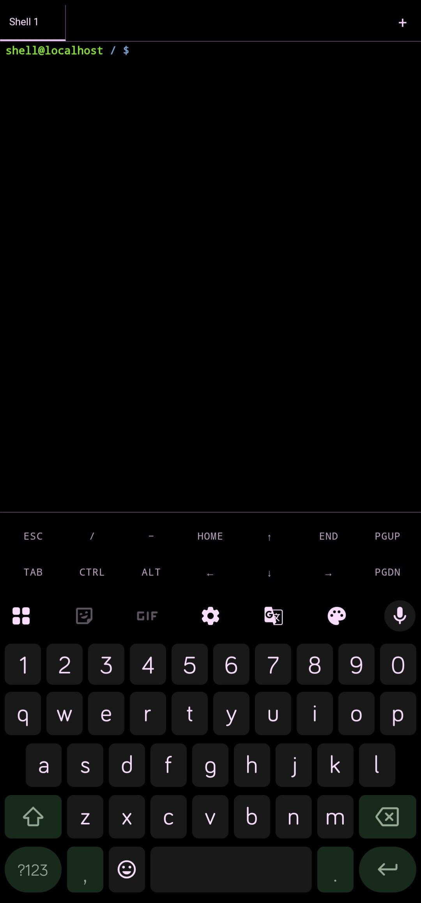

# Dioxamine Terminal

A terminal plugin for the [Dioxamine](https://github.com/rhythmcache/dioxamine) app, built using [xterm.js](https://xtermjs.org/).

## Features

- Interactive PTY shell over ADB
- Multi-tab sessions
- Termux-style on-screen key bar (Esc, Tab, Ctrl, Alt, arrows, Home/End, PgUp/PgDn)
- Follows the app's theme